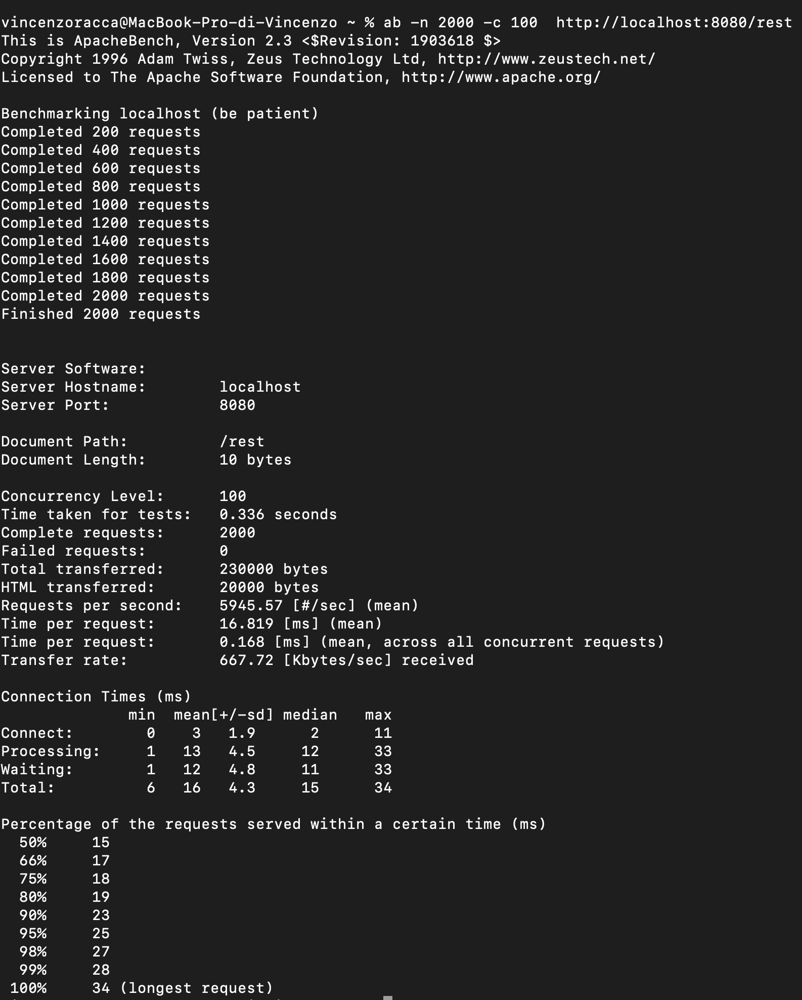

# gRPC vs REST performance

This project aims to compare the performance of **gRPC** and **REST**. \
The project is composed of the following microservices created with Spring Boot:
- grpc-server
- rest-server
- simple-client


The simple-client microservice provides two REST endpoints (`/grpc` and `/rest`), one that in turn invokes 
the gRPC server and another that invokes the REST server. \
The grpc-server and the rest-server return the same payload, which is an order consisting of 100 books.

There are no databases, there are no logs, the purpose of the project is to compare REST and gRPC without the influence of other factors.

## Comparison gRPC vs REST

The machine on which the tests were run is a MacBook Pro with a 2.6 GHz Intel Core i7 6-core processor and 32GB of memory.

The test was done with Apache Bench by making 2000 requests with a concurrency factor equal to 100:
```shell
ab -n 2000 -c 100  http://localhost:8080/grpc
ab -n 2000 -c 100  http://localhost:8080/rest
```


Here are the bar charts comparing the performance between the gRPC server and the REST server according to the results from the Apache Benchmark tests. As you can see:

- **Requests per Second**: The gRPC server handled many more requests per second compared to the REST server.
- **Time per Request (mean, ms)**: The average time per request was significantly lower for the gRPC server.
- **Time per Request (concurrent, ms)**: Even considering all concurrent requests, the time per request was much lower for gRPC.
- **Transfer Rate (Kbytes/sec)**: The transfer rate was higher for the gRPC server compared to the REST server.

**These charts clearly show that the gRPC server outperformed the REST server in terms of performance across all the metrics considered.**

## Screens

This is the screen of the test done for gRPC:


This is the screen of the test done for REST:


